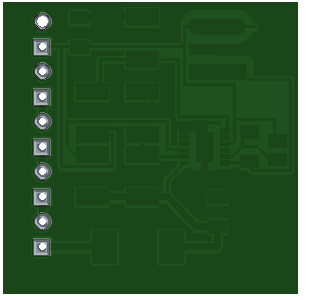
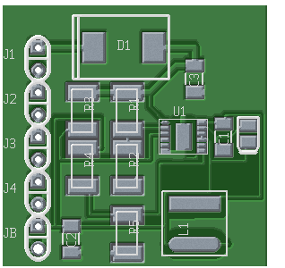

## SOLAR-CHARGER-PCB

This is a simple electronics experiment made in 2017, a solar
charger's circuit design made with gEDA for a small robot.

- A pdf of the schematic [here](./out/pdfs/solar-charger-pcb.pdf)

- Bottom:

- Top:

- Manufacturing files [here](./out/gerber/).
- Mathematical calculations [here](./doc/). The tm file can be
  openned with TeXmacs and the ods with Libreoffice.

